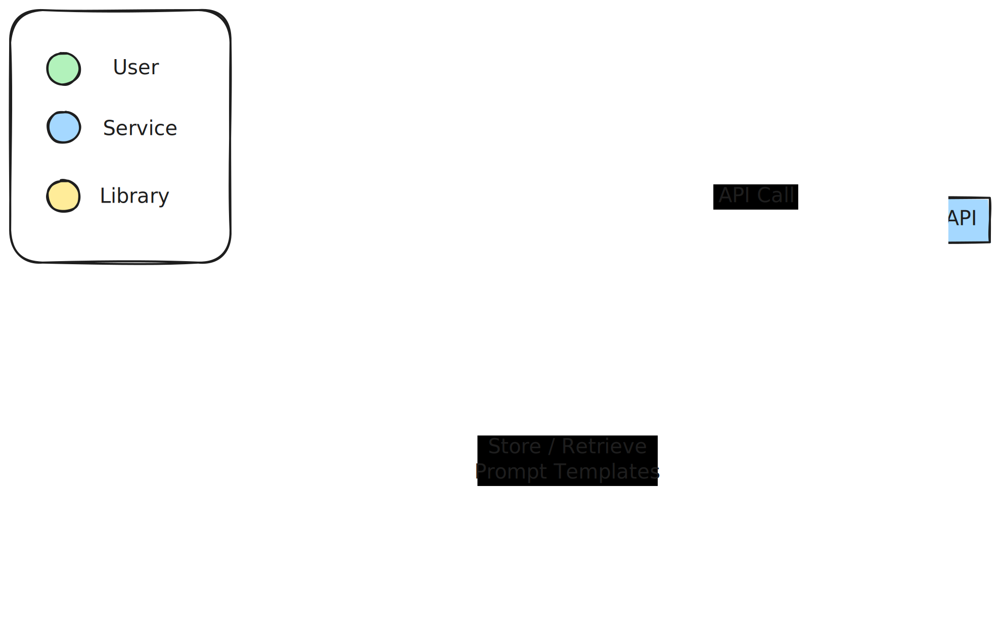

# Prompt Chain

prompt-chain is a powerful tool for creating config-as-code LLM agents.
It allows you to easily define the system prompt, user prompt, and response format for Large Language Models (LLMs),
allowing you to focus on creating sophisticated LLM agents through simple configurations.

## Purpose

By providing a structured way to define prompts and expected responses, it allows developers to:

- Quickly iterate on different prompt configurations
- Ensure consistency in LLM interactions
- Validate inputs and outputs automatically
- Chain multiple LLM agents together

## How It Works

prompt-chain consists of three main components:

- API Service
- Database Manager
- Chain Executor


### Prompt Chain API Service

The API service, built with FastAPI, provides endpoints for:

- Creating new prompt models
- Retrieving existing models
- Calling OpenAI's API with the specified model and user input

Key features of the API service include:

- Dynamic model creation based on user-defined schemas
- Input validation against the defined schemas (so your user prompt matches what the LLM expects)
- Output validation against the LLM response (so you can check your LLM isn't hallucinating)

### Database Manager

The `DatabaseManager` class handles all database operations, including:

- Adding new prompt models to the database
- Retrieving prompt models
- Validating user inputs and LLM responses against defined schemas

### Chain Executor

The `ChainExecutor` class handles th execution of a chain config which runs LLM agents sequentially.
It has the capability to

- Take input data from any previous step and use it in future steps
- Store each steps output(s) for later use
- Schema validation on each step's input and output


## Model and Chain Configurations


### Model Storage and Retrieval:

The prompt configs are stored in a database table `prompt_models`. The schema for this table is as follows:

```
class PromptModelTable(Base):
    __tablename__ = "prompt_models"
    id: Mapped[int] = mapped_column(Integer, primary_key=True, index=True)
    name: Mapped[str] = mapped_column(String, unique=True, index=True)
    system_prompt: Mapped[str] = mapped_column(String)
    user_prompt: Mapped[dict[str, Any]] = mapped_column(JSON)
    response: Mapped[dict[str, Any]] = mapped_column(JSON)
    created_at: Mapped[datetime] = mapped_column(DateTime(timezone=True), server_default=func.now())
    updated_at: Mapped[datetime] = mapped_column(
        DateTime(timezone=True), server_default=func.now(), onupdate=func.now()
    )
```

The system_prompt is a string, and is built with the impression that it includes the input and output schemas that would be passed to the LLM. eg. This would be a typical system prompt:

```
You are an AI assistant specialized in detecting crimes in web articles. Your task is to determine if a crime has been committed based on the given article text.

Input Schema:
{
    "article_text": "str"
}

Output Schema:
{
    "crime_detected": "bool",
    "explanation": "str"
}

Ensure your response is a valid JSON object matching the output schema.
```

The `user_prompt` and `response` stored in the table act as JSON representations of the schema defined in the system prompt, mapping out
each response key to a type. Primitive types are written as a string, whilst tuples, lists and dictionaries are defined my their respective
symbols.

For the system prompt example above, they would be defined as follows.

```
"user_prompt": {
    "article_text": "str",
}
```

```
"response": {
    "crime_detected": "bool",
    "explanation": "str"
}
```

### Chain Configuration

A chain configuration defines how multiple LLM agents work together. It includes:

- Name: A unique identifier for the chain
- Steps: An ordered list of steps, each referencing a model and defining input mappings
- Final Output Mapping: Defines how to construct the final output of the chain

Example chain configuration:

```python
chain_config = {
    "name": "crime_detection_chain",
    "steps": [
        {
            "name": "crime_detector",
            "input_mapping": {
                "article_text": "initial_input.article_text"
            }
        },
        {
            "name": "crime_classifier",
            "input_mapping": {
                "article_text": "initial_input.article_text",
                "crime_detected": "previous_step.crime_detected"
            }
        },
        {
            "name": "crime_summarizer",
            "input_mapping": {
                "article_text": "initial_input.article_text",
                "crime_type": "previous_step.crime_type"
            }
        }
    ],
    "final_output_mapping": {
        "crime_detected": "step_0.crime_detected",
        "crime_type": "step_1.crime_type",
        "summary": "step_2.summary"
    }
}
```

### Chaining LLM Agents

The chaining functionality allows you to create complex AI workflows by connecting multiple LLM agents.
Here's how it works:

1. Each step in the chain corresponds to a single LLM agent (model).
2. The input for each step can come from the initial input to the chain or the output of any specific previous step
3. The Chain Executor handles the flow of data between steps, ensuring each model gets the inputs it needs.
4. After all steps are executed, the final output is constructed based on the final_output_mapping.


## System Architecture


